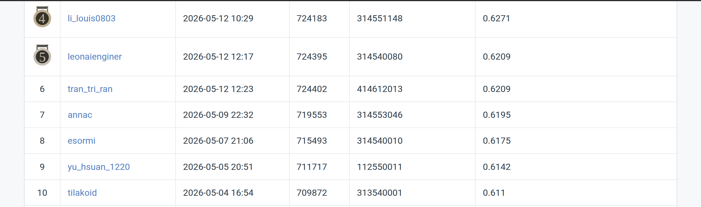

# Cell Instance Segmentation - Mask R-CNN
**NYCU Visual Recognition using Deep Learning (Spring 2026) - Homework 3**

[](https://pytorch.org/)
[](https://arxiv.org/abs/1703.06870)

This repository contains the implementation for the Cell Instance Segmentation task (Homework 3): segmenting four classes of cells in H&E-stained medical images, evaluated by **AP50** on a hidden CodaBench leaderboard.

## Introduction

The task ships 209 train images and 101 test images. Each training sample is a folder containing the source `image.tif` plus up to four mask files `class{1..4}.tif`, where every unique non-zero pixel value within a mask file represents one instance of that class.

Constraints (from the rubric):
- Must be Mask R-CNN-based.
- < 200M trainable params.
- Pure-vision only (no VLM / prompt models).
- ImageNet pretraining allowed.
- No external data.

This implementation uses ConvNeXt-Base (~107.56M params) as the backbone with Mask R-CNN, replacing
the classification + mask heads for 4 cell classes + background. Anchor sizes tuned to
`((8,),(16,),(32,),(64,),(128,))` for small cell instances. Training uses OneCycleLR, AMP mixed
precision, EMA (decay 0.9998), and AdamW optimizer.

## Environment Setup

```bash
cd HW3
python setup.py        # renames datesets→datasets, installs deps, sanity-checks dataset
```

Or manually:
```bash
pip install -r requirements.txt
```

Expected dataset layout (after setup):
```
HW3/datasets/
├── train/<UUID>/{image,class1,class2,class3,class4}.tif
├── test_release/<UUID>.tif
└── test_image_name_to_ids.json
```

## Usage

### Training

**Two-stage pipeline (80/30 val split → find best epoch → retrain on all data):**
```bash
bash train_twostage.sh [gpu_id]
```

**Direct training on all 209 images:**
```bash
python train_v2.py --run_name <name> --backbone convnext_base --batch_size 2 \
    --lr 2e-4 --wd 2e-3 --epochs 250 --pct_start 0.5 --gpu 0 --seed 42 \
    --val_frac 0.0 --workers 16
```

**K-Fold cross-validation (5 folds):**
```bash
bash train_kfold.sh [gpu_id]
```

Per-epoch metrics (train loss, val AP / AP50 / AP75, lr, grad norm) are written to `log/<run_name>.csv`.
Checkpoints saved to `checkpoints/<run_name>_{best,last,epNNN}.pth`.

### Inference & Submission

```bash
python submission.py checkpoints/<run_name>_ep250.pth --backbone convnext_base \
    --min_size 800 --max_size 1333 --anchor_sizes "8,16,32,64,128" \
    --box_detections_per_img 500 --tag <tag>
```

Produces `submission/test-results.json` (COCO RLE format, exact filename mandated by slides) and `submission/<run_name>_<tag>_HW3.zip` ready to upload to CodaBench.

## Performance

See CodaBench leaderboard screenshot below for final test AP50 score.



## Pre-Flight Reading

Before modifying the model:

1. **Mask R-CNN** (He et al. 2017, [arXiv:1703.06870](https://arxiv.org/abs/1703.06870)) — RoIAlign + parallel mask head.
2. **`torchvision.models.detection.mask_rcnn`** source — trace `forward` to know where to swap components.
3. **`pycocotools.mask`** — RLE encode/decode (note: `counts` must be a `str`, not `bytes`, for submission).
4. **`pycocotools.COCOeval`** — `iouType="segm"`, AP50 is `stats[1]`.

## Experiments

Key design decisions and ablations:

- **Backbone**: ConvNeXt-Base over ResNet-50 — 2× params (107.56M vs 46M), better feature quality for small cell instances.
- **Anchor tuning**: Custom anchors `((8,),(16,),(32,),(64,),(128,))` — cells are much smaller than COCO defaults.
- **Hyperparameter sweeps**: Grid over LR ∈ {2e-4, 5e-4, 7e-4, 8e-4, 1e-3} and WD ∈ {2e-3, 3e-3, 5e-3}.
- **Two-stage training**: Val split to find best epoch → retrain on full data. Found that the val-set peak underestimates full-data epochs needed.
- **K-Fold CV (K=5)**: Stratified 5-fold. Too slow for practical deadline; abandoned in favor of two-stage.
- **Speed optimizations**: `persistent_workers`, `--workers 16`. (`cudnn.benchmark=True` backfired with Mask R-CNN dynamic shapes.)
- **OOM handling**: Automatic batch-size halving on `torch.cuda.OutOfMemoryError` with global state guard.

Best single-model result: ConvNeXt-Base, BS=2, LR=2e-4, WD=2e-3, 250 epochs → **0.6110** CodaBench AP50.

## Author

Muhammad Rayhan Athaillah (賴瑞涵)  
Student ID: 313540001  
Affiliation: National Yang Ming Chiao Tung University (NYCU)
